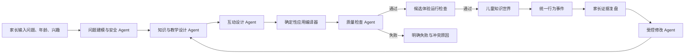

# Curiosity World 专属多能力 Agent Web 系统设计

> 日期：2026-08-15
>
> 状态：已批准
>
> 基座：Curiosity World `234ea2f5400344db968aa2040caee01331bac5f0`
>
> 产品范围：Web-only，6–10 岁儿童与家长共同使用

## 1. 目标与边界

Curiosity World 将孩子真实提出的“为什么”转换为受知识包约束、可以亲手操作的互动知识网页。产品不是课程平台、通用儿童聊天机器人或任意 HTML 生成器；核心产物是版本化互动体验规格，以及由确定性组件编译出的可运行应用。

本阶段完整交付 Web 产品，不开发原生 App、小程序、跨端同步、语音陪伴、虚拟人、支付、内容市场或长期能力画像。桌面与平板浏览器是儿童探索的主要环境，手机浏览器保证家长创建、查看与基本操作可用。

工程保留 Curiosity World 的多供应商模型配置、模型选择、API Key、Base URL、思考参数、服务端路由、异步任务、iframe、运行错误采集和持久化基础。用户界面不得暴露图片、视频、TTS、课堂或其他旧产品配置入口。

真实模型在工程完成后接入。开发与自动化验收使用严格的测试模型；真实模型 5×/5×/5 门禁作为独立接入验收保留，在接入前只能标记为待执行，不能宣称通过。

## 2. 产品信息架构

旧 Curiosity World 的“首页—生成预览—课堂”用户结构被完全替换：

```text
家庭工作台
  → 创建好奇问题
  → 专业能力协作生成
  → 儿童知识世界
  → 家长证据复盘
  → 受控修改与新版本
  → 好奇心档案
```

领域数据不使用课程 `Scene/Stage`。核心聚合是家庭档案、好奇问题、体验、不可变体验版本、Agent 运行、中间产物、行为事件和家长摘要。

## 3. 多能力 Agent 架构

系统使用六类专属能力。前五类用于首次生成，第六类用于继续修改。职责可以由同一供应商模型或不同模型承担，但每类能力都有独立角色定义、Prompt、输入 Schema、输出 Schema、权限和失败码。



### 3.1 问题建模与安全 Agent

输入：原始问题、年龄、兴趣、时长偏好和体验形式偏好。

输出：核心问题、同义问题、年龄带、兴趣线索、安全标签、支持状态、知识模型族候选和必要澄清。

权限：不能选择白名单外知识机制，不能生成互动规格。

确定性前置：年龄范围、高风险模式、明显包外问题在调用模型前直接失败。

### 3.2 知识与教学设计 Agent

输入：问题建模产物和唯一匹配的人工确认知识包。

输出：知识目标、因果关系、前置概念、允许词汇、禁止解释、常见误解、年龄表达策略、现实观察建议和知识包引用。

权限：只能引用传入知识包，不得开放检索或添加新机制。

### 3.3 互动设计 Agent

输入：问题建模产物、知识设计产物、白名单交互原语目录。

输出：体验情境、视觉主题、变量选择、任务顺序、预测、自由探索、引导发现、迁移挑战、解释任务、即时反馈和结束条件。

权限：只能组合已有原语并在知识包变量范围内取值，不能生成代码、坐标公式、状态机或事件协议。

### 3.4 确定性应用编译器

输入：通过 Schema 与知识规则校验的结构化体验规格。

输出：CSP 受限的 HTML/CSS/JavaScript、状态机、物理或因果关系、统一事件协议和规格哈希。

性质：非 LLM。坐标、碰撞、时间步进、变量范围、正确答案、事件信封和运行握手全部由代码提供。

### 3.5 质量检查 Agent

输入：全部结构化中间产物和最终体验规格，不读取模型隐藏思维链。

输出：年龄适配、兴趣关联、知识一致性、误解风险、交互可完成性、迁移有效性和文案负担的逐项审查结果。

权限：只能通过或拒绝，不能直接篡改规格。质量 Agent 通过后仍须通过确定性 Schema、知识、事件、编译和运行检查；确定性失败拥有最终否决权。

### 3.6 受控修改 Agent

输入：当前活动版本、家长修改要求、原始知识包和全部中间产物。

输出分两步：先生成影响分析，再生成白名单字段级补丁。影响分析必须说明将修改和保持不变的部分。补丁通过首次生成同等级的安全、知识、Schema、事件、编译、质量和运行检查后，候选版本才能激活。

## 4. 结构化交接与可观测性

Agent 之间不共享自由文本聊天历史，只通过版本化 JSON 产物交接：

- `QuestionModelArtifactV1`
- `KnowledgeDesignArtifactV1`
- `InteractionDesignArtifactV1`
- `CuriosityExperienceSpecV2`
- `QualityReviewArtifactV1`
- `RevisionImpactArtifactV1`
- `CuriosityPatchV2`

每个产物包含 `artifactId`、`runId`、`agentRole`、`schemaVersion`、`createdAt`、上游产物 ID 和知识包版本。Agent 运行记录包含模型路由、开始与结束时间、状态、失败码和产物 ID，但不保存或展示隐藏思维链。

生成任务持久化全部阶段和中间产物。刷新后家长可以恢复生成状态；失败时可以看到失败能力、已完成阶段和可操作原因。

## 5. 三个知识模型族

### 5.1 相对位置与运动

知识包覆盖月亮跟随、远山移动慢和车窗近景移动快。核心原语是移动观察者、近远物体比较和距离迁移。确定性变量包括观察者位移、近物距离和远物距离。

### 5.2 平衡、支撑与简单受力

知识包覆盖桥梁支撑和积木稳定性。核心原语是放置支撑点、移动重心、改变底座宽度和承载测试。确定性规则只表达简化静态平衡、支撑范围和重心投影，不模拟材料破坏或复杂结构工程。

### 5.3 光线、遮挡与路径

知识包覆盖影子长度和受控的彩虹光路示意。核心原语是移动光源、移动遮挡物、改变入射角和追踪白名单光线路径。确定性规则提供直线传播、遮挡、简单反射或色散示意；模型不能创建任意光学机制。

三个模型族共用 Agent 交接、任务、版本、事件和运行协议，但拥有独立知识规则、变量约束、原语实现和编译插件。MVP 至少提供三个预置问题，并接受同族新表述或新情境。

## 6. Web UI 与核心流程

### 6.1 家庭工作台

主输入是孩子的问题、年龄和兴趣。可选输入为体验时长与动画、模拟实验或故事任务偏好。页面使用普通家庭语言展示三个支持领域及示例，不要求家长理解学科术语。

历史内容按孩子的问题组织，显示当前版本、最近探索时间和继续入口，不出现课程章节或学习进度排名。

### 6.2 专业能力协作页

生成过程使用专业工作流轨道，不使用五个聊天气泡，也不伪造思维过程。页面逐步展示真实结构化结论：

- 已确认的核心问题与安全范围
- 选择的知识模型和知识包版本
- 知识目标、前置概念与需要避免的误解
- 变量、任务、反馈和事件要求
- 质量与运行检查结果

提交后 1 秒内必须出现第一个有意义状态。失败时停留在失败阶段并显示稳定错误码，不生成替代内容。

### 6.3 儿童知识世界

儿童端全屏运行，不出现 Agent、模型、Schema、版本、设置或技术错误。每次只呈现一个主要任务，连续完成好奇钩子、自由探索、引导发现、迁移挑战和说给别人听。

交互以拖动、选择和排序为主，不依赖键盘。操作后 100ms 内产生视觉变化；反馈解释发生了什么，不只显示对错。错误预测保留为观察起点，不使用惩罚性语言。

6–7 岁硬约束：主要指令单句不超过 16 个汉字，同时最多两个核心变量，主要任务不超过四步。

8–10 岁硬约束：主要指令单句不超过 28 个汉字，同时最多三个核心变量，主要任务不超过五步。

所有主要触控目标最小 44×44 CSS 像素，颜色对比满足 WCAG AA，动画支持 `prefers-reduced-motion`。儿童无需阅读产品说明即可开始主要路径。

### 6.4 家长证据复盘

家长页只显示可由事件证明的事实，每项事实附事件 ID。知识包建议、年龄适配说明和行为事实分区呈现，不能混为模型推断。不得出现掌握度、能力评分、诊断或排名。

页面提供修改输入、影响分析、候选运行状态、不可变版本历史和失败版本原因。

### 6.5 好奇心档案

档案保存家庭本地的好奇问题、体验版本、行为摘要和现实观察建议。MVP 不生成长期能力画像。推荐的后续问题必须来自已批准知识包中的迁移关系。

## 7. 文案系统

家长端语气可靠、透明、不过度教育化：

- “正在确认孩子真正想问的是什么”
- “已找到经过确认的相对运动知识模型”
- “正在把规律变成孩子可以操作的实验”
- “这个版本没有通过年龄表达检查，因此未发布”

儿童端使用短句和动作语言：

- “先猜一猜”
- “拖动看看”
- “换个地方试试”
- “选一个说给家长听”

用户可见界面禁止出现课程、教师、同学、课堂、章节、幻灯片、白板、PBL、课堂 TTS 和视频导出语义。

## 8. 模型与配置

保留 Curiosity World 多供应商能力，新增 Curiosity 角色路由：

- `curiosity.question-modeler`
- `curiosity.knowledge-designer`
- `curiosity.interaction-designer`
- `curiosity.quality-reviewer`
- `curiosity.revision-planner`

每个角色可以继承默认模型，也可以选择独立供应商、模型和思考参数。前端只呈现“默认模型”和五个角色的高级路由，不显示图片、视频、音频、PDF、搜索或旧 Agent 配置。

没有任何可用模型时以 `MODEL_UNAVAILABLE` 失败。角色模型输出非法、超时或拒绝时不切换到模板或其他模型。测试模型只能由明确测试环境变量启用。

## 9. 存储与版本

浏览器使用 IndexedDB，服务端保留与 UI 解耦的仓储接口。体验版本不可变，当前活动版本单独指向。Agent 运行和中间产物属于体验版本候选；候选只有通过 iframe 就绪握手才激活。失败候选保留失败码，原活动版本继续可用。

行为事件按 `eventId` 去重并绑定体验版本。摘要只消费当前选中版本的有效事件。刷新后恢复家庭工作台、活动体验、Agent 生成状态、版本历史和摘要。

## 10. 失败策略

- 年龄越界、高风险和明显包外问题在模型调用前停止。
- Agent 输出不符合 Schema 时标记具体角色失败。
- 上下游产物引用、知识包版本或因果关系不一致时不得进入下一能力。
- 知识包外机制、禁止误解、年龄表达超限或兴趣关联虚构时拒绝候选。
- 编译错误、运行错误或就绪超时时标记 `RUNTIME_FAILED`。
- 质量 Agent 与确定性检查冲突时以确定性检查为准。
- 修改越权、跨模型族或破坏已确认规则时保留原版本并明确失败。
- 不使用通用课程、固定体验或旧版本复制作为兜底。

## 11. 测试与验收

### 11.1 Agent 契约

单元测试覆盖六类结构化产物、严格 Schema、角色 Prompt 边界、产物引用、知识包版本、年龄词汇、兴趣关联、原语白名单和失败码。契约测试证明每个角色不能输出其他角色负责的字段。

### 11.2 三知识族

每个模型族覆盖知识边界、变量范围、禁止误解、编译插件、至少两类有效交互和统一事件。三个预置问题及每族至少一个同族新表述完成生成、运行、修改和恢复闭环。

### 11.3 Web 体验

组件与 Playwright 测试覆盖家庭工作台、1 秒内阶段反馈、Agent 结构化结果、儿童单任务流程、100ms 视觉反馈、触控尺寸、年龄文字限制、事件摘要、修改影响分析、候选激活、失败保持旧版本、刷新恢复和禁止语义扫描。

### 11.4 工程门禁

执行：

```bash
pnpm check
pnpm lint
pnpm check:i18n-keys
pnpm test
pnpm build
pnpm test:e2e
```

工程完成要求上述门禁通过，并且没有用户可见旧产品路径。真实模型接入后执行每个主案例的重复生成、修改和拒绝门禁，保存模型路由、耗时、产物哈希、检查结果、事件和失败码。未接入真实模型时状态必须明确为 `LIVE_MODEL_PENDING`，不能写作通过。

## 12. 实施顺序

1. 建立多 Agent 契约、角色路由和结构化运行记录。
2. 将 Moon 单次生成重构为五能力生成及受控修改管线，完成结构化协作 UI。
3. 强化儿童 Web 体验、年龄硬约束和家长影响分析。
4. 新增平衡受力与光影路径知识包、原语、编译插件和预置问题。
5. 建立好奇心档案与完整恢复。
6. 删除或隔离剩余用户可见旧语义，完成全量工程门禁。
7. 在用户接入真实模型后执行真实模型准入门禁。

此顺序不会缩减最终三知识族范围；Moon 阶段用于验证多能力 Agent 协议和 Web 运行链，随后必须复用同一架构完成另外两个模型族。
